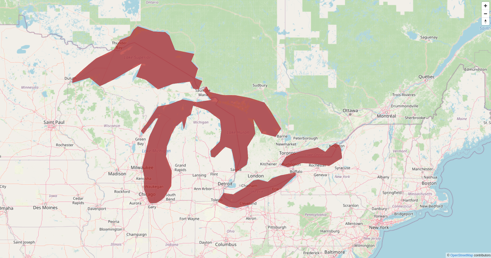

# mapbox-gl-ogc-feature-collection

A small package for requesting geojson from an OGC Feature API endpoint to serve tiles in MapBox/MapLibre.

Built with inspiration from [mapbox-gl-arcgis-featureserver](https://github.com/rowanwins/mapbox-gl-arcgis-featureserver).

### Demo

Check out the demo at [this link](https://mkeller3.github.io/mapbox-gl-ogc-feature-collection/). This demo pulls
in large lakes OGC Feature API collection at [https://demo.pygeoapi.io/stable](https://demo.pygeoapi.io/stable).
In the demo, we are using the collection `lakes`.



### Basic Usage
````javascript
import OGCFeatureCollection from 'mapbox-gl-ogc-feature-collection'

map.on('load', () => {
    const sourceId = 'collection-src'

    new OGCFeatureCollection(sourceId, map, {
        url: 'https://demo.pygeoapi.io/stable',
        collectionId: 'lakes',
        limit: 10000
    })

    map.addLayer({
        'id': 'lyr',
        'source': sourceId,
        'type': 'fill',
        'paint': {
            'fill-color': '#B42222',
            'fill-opacity': 0.7
        }
    })
})
````

## API
This library exposes a single `OGCFeatureCollection` class 

### Constructor Options
| Option | Type | Description |
--- | --- | ---
| `sourceId` | `String` **required** | A string  |
| `map` | `Object` **required** | A `mapbox-gl` or `maplibre-gl` `map` instance. |
| `collectionOptions` | `Object` **required** | A range of options which will be used to manage the collection. See below. |
| `geojsonSourceOptions` | `Object` | A object which will be passed to the creation of the mapbox-gl [geojson source](https://docs.mapbox.com/mapbox-gl-js/style-spec/sources/#geojson) |


#### Collection Options
| Option | Type | Default | Description |
--- | --- | --- | ---
| `url` | `String` **required** | | The base url of the OGC Feature API. `https://demo.pygeoapi.io/covid-19`.|
| `collectionId` | `String` **required** | | The name of the collection. `cases_country`.|
| `limit` | `Number` | `5000` | Number of features to return in each tile. |
| `properties` | `String` | | List of properties to return for each feature. |
| `datetime` | `Date` | | Date or date range to filter items. |
| `useStaticZoomLevel` | `Boolean` | `false` | Whether to only get tiles at a single zoom level. If true then set `minZoom` to the desired level. |
| `minZoom` | `Number` | if `useStaticZoom` is `true` then `7`, otherwise `2` | The zoom level to start requesting tiles. |


### Methods
| Method  | Description |
------- | -----------
| destroySource() | **Important** The `destroySource()` method removes the source from the map and associated event listeners for retrieving data which request data as the map is panned, so it's important to call this method if removing the layer from the map completely. |
| disableRequests() | **Important**  The `disableRequests()` method temporarily disables the associated event listeners for retrieving data which request data as the map is panned, you may want to call this if you toggle your layer off. |
| enableRequests() | **Important**  The `enableRequests()` method enables the associated event listeners for retrieving data which request data as the map is panned. By default this is called by the constructor. |

#### Example of disabling and enabling requests
It would be nice if disabling/enabling of requests happened automatically but unfortunately I haven't found a way to make that happen because of how `sources` and `layers` are managed in mapbox-gl.

````javascript
import OGCFeatureCollection from 'mapbox-gl-ogc-feature-collection'

map.on('load', () => {
    const sourceId = 'collection-src'
    const lyrId = 'lyr'

    const service = new OGCFeatureCollection(sourceId, map, {
        url: 'https://demo.pygeoapi.io/stable',
        collectionId: 'lakes',
        limit: 10000
    })

    map.addLayer({
        'id': 'lyr',
        'source': sourceId,
        'type': 'fill',
        'paint': {
            'fill-color': '#B42222',
            'fill-opacity': 0.7
        }
    })
})
    
    
function hideFsLayer () {
    map.setLayoutProperty(lyrId, 'visibility', 'none')
    service.disableRequests()
}
function showFsLayer () {
    map.setLayoutProperty(lyrId, 'visibility', 'visible')
    service.enableRequests()
}
function removeFsCompletelyFromMap () {
    map.removeLayer(lyrId)
    service.destroySource()
}
````